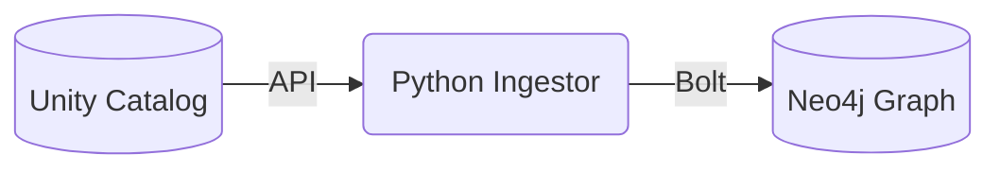

# Lineage Extract POC

This Proof of Concept (POC) demonstrates how to extract table lineage from Databricks Unity Catalog and ingest it into a Neo4j graph database for visualization and analysis.

## Overview

The project uses the Databricks SDK to fetch table lineage information and the Neo4j Python driver to store this data as a graph. It specifically targets catalogs defined in the mesh architecture (e.g., `adp_dll_acc_clean`, `adp_dll_acc_prep`).

### Architecture



## Prerequisites

- **Python**: 3.12 or higher.
- **uv**: Recommended for dependency management.
- **Docker**: To run the Neo4j instance.
- **Databricks CLI**: Configured with a profile that has access to Unity Catalog and Statement Execution.

## Setup

### 1. Environment Configuration

Create or update the `.env` file in the root directory:

```env
DATABRICKS_PROFILE=your-profile-name
DATABRICKS_WAREHOUSE_ID=your-warehouse-id
NEO4J_USER=neo4j
NEO4J_PASSWORD=password
TARGET_CATALOG=main
```

### 2. Start Neo4j

Run the following command to start the Neo4j container with Graph Data Science (GDS) enabled:

```bash
docker compose up -d
```

Access the Neo4j Browser at [http://localhost:7474](http://localhost:7474) (Login: `neo4j/password`).

### 3. Install Dependencies

Using `uv` is the recommended way to manage dependencies:

```bash
# Install dependencies and create a virtual environment
uv sync
```

*Alternatively, using standard pip:*
```bash
pip install .
```

## Usage

Run the ingestion script using `uv`:

```bash
uv run ingest_lineage.py
```

*Alternatively, using the virtual environment directly:*
```bash
python ingest_lineage.py
```

The script will:
1. Connect to Databricks and Neo4j.
2. List tables in the configured catalogs.
3. Fetch lineage for each table using the Lineage Tracking API.
4. Write relationships (`FEEDS_INTO`) to Neo4j.

## Exploration

Once ingested, you can query your lineage in the Neo4j Browser:

**View all table relationships:**
```cypher
MATCH (s:Table)-[r:FEEDS_INTO]->(t:Table)
RETURN s, r, t
LIMIT 100
```

**Find all dependencies of a specific table:**
```cypher
MATCH (t:Table {name: 'catalog.schema.table_name'})<-[:FEEDS_INTO*]-(upstream)
RETURN t, upstream
```
**Find table with most downstream impact:**
```cypher   
MATCH (t:Table) 
OPTIONAL MATCH (upstream)-[:FEEDS_INTO*]->(t) 
OPTIONAL MATCH (t)-[:FEEDS_INTO*]->(downstream) 
RETURN t.name AS table_name, t.catalog AS domain, count(DISTINCT upstream) AS total_upstream_dependencies, count(DISTINCT downstream) AS total_downstream_impact 
ORDER BY total_downstream_impact DESC
```
